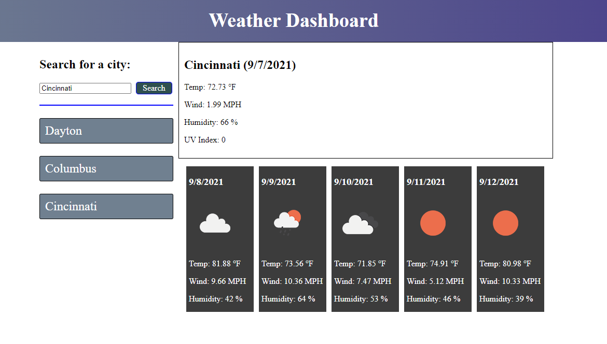

# Weather Dashboard

## Application Link
<https://griveroll86.github.io/weather/index.html>

## Weather Dashboard
This assignment asked us to use Open Weather API to create our own weather dashboard. A search bar allows the user to type a city name and retrieve the current day's weather, as well as, the weather for the next five days. A history of searches should be generated beneath the search bar.

## Files Edited
* index.html
* style.css
* script.js

## API/Libraries Used
* Open Weather API
* Moment.js

## Preview Image
